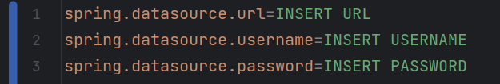

# SmartMat - Project in System Development 2 IDATT2106

## Description
SmartMat is a simple app for organising your refrigerator and shopping list, 
with the purpose of reducing food waste. SmartMat allows you and your family 
to easily plan your shopping trips, and also keep track of your refrigerator at home. 
To reduce food waste the app recommends recipes based on which foods in your fridge whose expiration date is near, 
thus reminding you to use all the ingredients you buy. Food waste is a large environmental problem 
and with SmartMat you can contribute to the solution.

## Table of contents
- [Team members](#team-members)
- [Intended audience](#intended-audience)
- [Database](#database)
- [Frameworks used](#frameworks-used)
- [Application](#application)
- [Security](#security)
- [How to run and install the backend]()
- [How to run and install the frontend](#how-to-run-and-install-the-frontend)
- [How to use the application](#using-the-application)
- [Testing](#testing)
- [Future work](#future-work)

### Team members

- Anna Marie Bøe Tvedt
- Edvard Sørby
- Fredrik Bache Ruud
- Jens Christian Lund
- Karo Faraidoun Mahmoud
- Marte Solli Vågen
- Nils William Ormestad Lie

### Intended audience
The intended audience for this application are primarily private households 
wanting to control their food waste. SmartMat also focuses on households 
with smaller children, as they can receive an account with limited functionality. 
Currently, the application is only available in English, 
but future versions aim to add support for multiple languages.

### Database

### Frameworks used

SmartMat is built on the following:
- Vue.js in frontend
- Vuetify for frontend design
- SpringBoot in backend
- JWT for safe user registration and authentication
- MySQL for data storage (Database hosted on available NTNU servers)
- Swagger for API documentation
- H2 for quick in-memory testing
- ChatGPT API for generating recipes

### Application
Smart is built upon the principle of Separation of concerns, 
which implies that it is divided into different sections. 
Each section handles a specific concern, leaving other concerns to the 
other sections. This ensures great code readability as well as easy modifications, 
since one section has minimal impact on other sections.
Below are the different sections and how we have implemented them:

*The database section*  
This is the model folder. Each class in this folder creates 
a table in the database on startup, 
complete with attributes and relations.

*The persistence section*  
This is the repository folder. 
This folder contains interfaces that implements 
JPARepository which enables us to access the database and 
perform queries.

*The business section*  
This is the service folder. 
All the logical operations are performed in this folder, 
with different methods for saving, retrieving, 
deleting and updating data from the database.

*The presentation section*  
This is the controller folder. 
This folder contains all the controllers used to communicate 
with the database. These controllers again contains 
endpoints that the frontend uses to manipulate the database. 
The controllers also handles all validation of incoming data 
and error handling, sending only sanitary data down to the 
business section.

In our code, each model has a correlating repository, and each 
controller has a correlating service. 
Each service may use one or more repository. 
They are grouped since not every repository serves a 
purpose on its own. We have worked with the theory that 
every endpoint needs to serve a specific purpose. 
Any redundant enpoints, and its similarly redundant services 
will be deleted.

### Security

The application uses tokens provided by JWT to authenticate a user each 
time they maneuver the application. To use the application and access their data, 
they need to log in with their email and password. If correct, 
they recieve a token which is stored in the frontend's localStorage. 
This token needs to be provided with every API-call, in order 
to access the endpoint. The token is deleted from the 
frontend when logging out. Using BCryptPasswordEncoder, 
all passwords are salted and hashed in the database, no 
passwords are stored in clear text.

### How to run and install the backend

To run backend, you need some prerequisite programs. 
You need both Java and Maven downloaded and installed.

- You can download Java [here](https://www.oracle.com/java/technologies/downloads/#java17)
- And Maven [here](https://maven.apache.org/download.cgi)

Once these are installed you are ready to begin. To ensure you have maven correctly installed run:

    mvn --version

If this returns the version of Maven you just installed, run the following command to clone the project:

    git clone https://github.com/karofmah/SmartMat-Backend.git

You might have to type in your personal password when cloning. When the project has been cloned down, the pom.xml dependencies must be downloaded using the command:

    mvn dependency:resolve

After that, the package must be installed into the local repository, using the commmand:

    mvn install 

In the application-central.properties class, you can specify which database to use with the project (url, username and password). To get access to the centralized IDI MySQL database, please reach me at karo.f.mahmoud@gmail.com

  

To run the application, maneuver to root directory containing the pom.xml file and run:

    mvn spring-boot:run

Congratulations! Your Smartmat backend is now up and running!
### How to run and install the frontend
As stated earlier, the project frontend uses the Vue.js Framework. 
Before downloading Vue, you need [Node.js](https://nodejs.org/en/download/) installed.
Download the version that matches your operating system. 

Once the installer is downloaded:
- When prompted to run - click **run**.
- When welcomed by the wizard - click **next**.
- Review the license agreement and click **next** if you agree to the terms.
- The installer will prompt you for the installation location.
Leave the default location then click **next**.
- Finally, click the **installation** button to run the installer. When it finishes, click **Finish**.

Verify installation by writing into your terminal of choice:

    node -v

Do the same for NPM:

    npm -v

Now that npm is installed, Vue.js can be downloaded through the use of the command:

    npm install vue

After installing Vue, the frontend project can be opened. Clone the project from our [Github repo](https://github.com/karofmah/SmartMat-Frontend)
either by clicking the link or executing the following command in a folder of your choice:

    git clone https://github.com/karofmah/SmartMat-Frontend.git

After cloning the project, open it either in your preferred IDE or in a terminal.
To download all dependencies, run the command:

    npm install 

To start the application, run:

    npm run serve 
If you have the backend up and running,
head to [http://localhost:8000/#/](http://localhost:8000/#/)
and start using SmartMat!

### Using the application
SmartMat is an intuitive and easy-to-use application that behaves
like a lot of similar applications:
- The first page the user will see is the login page. Here, the user
can either log in with an already existing user, or register a brand-new
user, by filling out the required fields. (Test users with test data
will be provided below)
- After logging in, the user is directed to the "Users" page. Here they will
see all their registered "members". Members can either be adults or children
and depending on their role, some functionality might not be available.
Each adult has their own pin-code, while children do not.
- After selecting a member, the user will be directed to their Fridge.
Here, they can see all the food they have stored, edit the expiration date,
remove food while tagging it as eaten or thrown, add new food-items
and generate recipes. at the top of the page, the user will also see
a toolbar with links to the applications other pages.
- The next page in the toolbar is the Shopping List. It does exactly what
it sounds like: an Adult user can add items to it, remove them, edit them and
buy them by pressing the fridge icon in the top right. A Child user can
also add items to the list, but not do anything else.
- The next page is the Menus page. Here an Adult user can generate recipes
for the entire week for 1 or up to 10 people.
- Next up is the settings page. Here an Adult user can see and 
edit the account information, add new members as well as change 
member info. A Child user can not edit or add any new members.
- The stats page is up next. Here, any type of user can see the amount
of food their account has thrown in a selected year, the average amount of
food thrown by all other accounts registered in the course of a selected year,
as well as the amount of garbage thrown monthly, both by the users account
and the average of all other registered accounts.
- There are two icons left in the toolbar: "Users", which will route the
user back to the page with all the members and "Sign Out", which will
sign the user out completely and route them back to the login page.
- There is also a colour theme switch, furthest to the right of the 
toolbar.

### Testing

We have continuously developed tests while working on the application.
To run tests for backend, use the command:

    mvn test

To run the tests for frontend, use the terminal command:

    npm run test:unit

If you want to run the tests with coverage, use the following command instead:

    npm run test:coverage

### Test users

The following users can be used as test users.

- Email: frida01@stud.ntnu.no
- Password: password
- Pin code: 1234
- Email: henrik100@stud.ntnu.no
- Password: password
- Pin code: 1234
- Email: stig1978@stud.ntnu.no
- Password: password
- Pin code: 1234
- Email: pål.einar@stud.ntnu.no
- Password: password
- Pin code: 1234

### Future work

While the team is satisfied with how the application turned out after 3
weeks of hard work, there is some functionality we would implement if
we had more time.
- When generating a weekly menu, the user should be asked if they would like to
add all the ingredients to their shopping list.
- As the application is currently only available in English, we would
like to have it dynamically changing language based on the user's own
language in their browser.
- When items in the fridge are nearing their expiration date, it would be
preferable if the user was alerted to which items it concerns.
- The stats could be extended with info about days and weeks.
- Add functionality so the user can see which stores nearby that 
have the items in their shopping list, preferably on sale.

### License

MIT License

Copyright (c) 2023 idatt2106-2023-01

Permission is hereby granted, free of charge, to any person obtaining a copy
of this software and associated documentation files (the "Software"), to deal
in the Software without restriction, including without limitation the rights
to use, copy, modify, merge, publish, distribute, sublicense, and/or sell
copies of the Software, and to permit persons to whom the Software is
furnished to do so, subject to the following conditions:

The above copyright notice and this permission notice shall be included in all
copies or substantial portions of the Software.

THE SOFTWARE IS PROVIDED "AS IS", WITHOUT WARRANTY OF ANY KIND, EXPRESS OR
IMPLIED, INCLUDING BUT NOT LIMITED TO THE WARRANTIES OF MERCHANTABILITY,
FITNESS FOR A PARTICULAR PURPOSE AND NONINFRINGEMENT. IN NO EVENT SHALL THE
AUTHORS OR COPYRIGHT HOLDERS BE LIABLE FOR ANY CLAIM, DAMAGES OR OTHER
LIABILITY, WHETHER IN AN ACTION OF CONTRACT, TORT OR OTHERWISE, ARISING FROM,
OUT OF OR IN CONNECTION WITH THE SOFTWARE OR THE USE OR OTHER DEALINGS IN THE
SOFTWARE.

